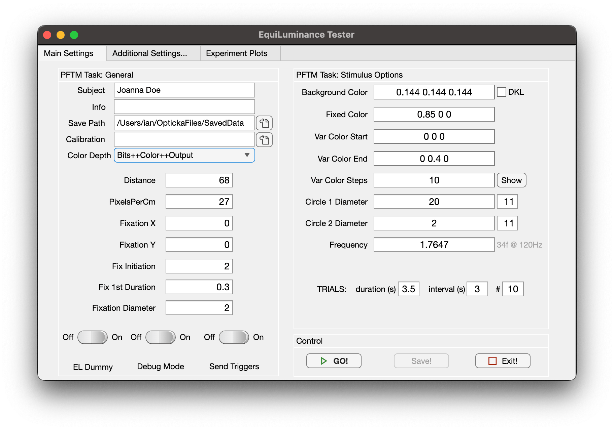
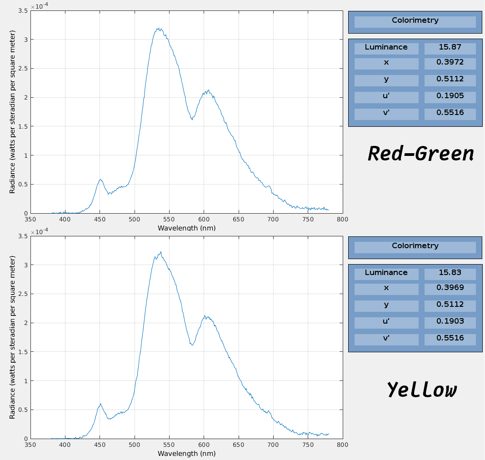

# Equiluminant
Perceptual equiluminance testing using pupillometry / minimum flicker and minimum motion measurements. These require [opticka](https://github.com/iandol/opticka) to be installed to function. The GUIs allow you to modify most options and then run the task:

There are three different tasks:

* EquiLum.mlapp — GUI to run equiluminant task.
* EquiFlicker.mlapp — GUI to run minimum flicker task.
* Equimotion.mlapp — GUI to run minimum motion task.
* pupilPower.m — class to load eyelink file & perform PFTM analysis from pupil data.
* pupilPowerReport.rpt — MATLAB report generator, automate analysis of a list of eyelink files.

For equimotion we also developed a version of Cavanagh's composite yellow grating which blends red and green on alternating pixel lines to generate yellow. This is spectrally identical to mixing the R and G channels as measured with the SpectroCal:

