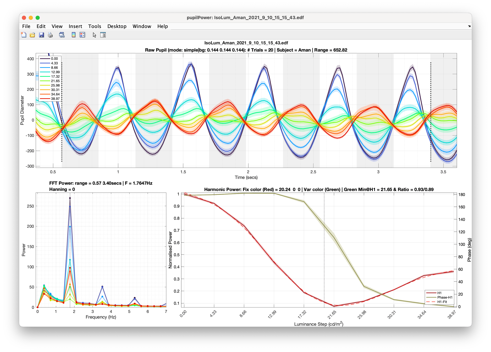

# Pupil Frequency-Taging Method (PFTM) Equiluminance Testing
Perceptual equiluminance testing using pupillometry (Pupil frequency Taggimg Method) + minimum flicker and minimum motion measurements. These experiments depend on the [Opticka experimental framework](https://github.com/iandol/opticka) and PTB to be installed to function. The GUIs allow you to modify most options and then run the task. For the

There are three different tasks:

* `EquiLum.mlapp` — GUI to run equiluminant task.
* `EquiFlicker.mlapp` — GUI to run minimum flicker task.
* `Equimotion.mlapp` — GUI to run minimum motion task.

And some analysis tools:
* `pupilPower.m` — class to load eyelink file & perform PFTM analysis from pupil data.
* `pupilPowerReport.rpt` — MATLAB report generator setup, pass in a YAML list of eyelink files to automate analysis and generate a PDF report.
* `runEquiMotionPlot.m`` — a function to replot the psychometric curve fits from the EquiMotion task.

## Equimotion "Yellow"

For equimotion we developed a procedural (GLSL) shader version of Cavanagh's composite yellow grating which blends red and green on alternating pixel lines to blend-to-yellow. In testing we confirmed that this is spectrally identical to mixing the R and G channels per-pixel as measured with the SpectroCal:

# Analysis

`pupilPower.m` loads a single EDF file generated by `EquiLum.mlapp` and parses it and plots the results:

There are many options to modify the analysis, see the class properties for more details...
